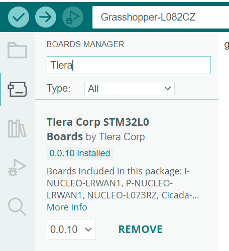

# grashopper-bme680
Integrate Bosch BME680 sensor (temperature, humidity, barometric pressure, air quality index) in a battery-powered design with LoRaWAN communication. The challenge is to design hardware and software in a way that allows operation of the device for several months without the need to change the battery.

## Prerequisites

You should be familiar with LoRaWAN, especially The Things Network
https://www.thethingsnetwork.org/ 

You should have an account, and know how to set up an application and create
end devices and monitor their traffic.

Optionally, I guess you want to visualize the collected data in some way, 
so you should also be familiar with some kind of backend integration
(e.g. via Node-RED into an InfluxDB where data can be visualized using Grafana)

You should already have some experience with the Arduino IDE 2.x.

## Hardware

* Grasshopper LoRaWAN Development Board (ST32L082 , SX1276 LoRa Radio)
  https://www.tindie.com/products/TleraCorp/grasshopper-lorawan-development-board/
* CJMCU-680 BME680 Breakout Board
* Breadboard, cables, USB-cables etc.

## How to start

### Wiring up

TODO: Fritzing picture 

### STM32L0 support
You need to get support for STM32L0-type boards in Arduino: Please follow the steps depicted here: https://github.com/GrumpyOldPizza/ArduinoCore-stm32l0

Connect the Grashopper board with a USB cable. A green LED should indicate that it has power. Windows should automatically create a new COM port. Check in the Windows Device Manager. If you hear a sound whenever you unplug and plug in the USB cable again, but no COM port appears ... then you have a problem (like me).

To solve this problem, in the screen for removing apps from Windows 11, search for "STM32" and delete every STM32 driver. And then reboot. After that, the COM port appeared. Seems a lot of old drivers have piled up during the years, and in the meantime Windows has native driver support for the STM32 boards.

To reset to STM32 bootloader, you may press the BOOT button on the Grasshopper board, press the RST button, release the RST button and finally release the BOOT button. This might also help in kind of problems.

### Grashopper board support
Now you need to get support for the Grasshopper board in the Arduino IDE.

In the Boards Manager, look out for "Tlera" and install.

Now, choose the Grashopper board and unter tools --> board select the serial COM port.

If you have followed the instructions, you now have set up Grasshopper-L082CZ as board in the Arduino IDE.

Start with some example code on github.com https://github.com/kriswiner/CMWX1ZZABZ/tree/master/Grasshopper

Copy and paste Blink_Grasshopper.ino as new sketch in the Arduino IDE.

### BSEC and BME680 support

In the Arduino Library Manager, search and install *BSEC Software Library* by Bosch Sensortec.

Try to compile the example source code from this repository.

The warning message can be ignored.

Expect to get the following error message:

The platform does not support 'compiler.libraries.ldflags' for precompiled libraries.

This get a little bit tricky here, you need to change your compiler flags to get things running. The instructions given here worked for me: https://github.com/micro-ROS/micro_ros_arduino/issues/819#issuecomment-1063712602

Now you should be able to compile the example and send it to the Grasshopper board. 

Open a serial monitor in Arduino IDE to see what is going on.

## How to reduce power consumption

* The source code samples new sensor values only every 300 seconds (5 minutes). However, for convenience, I also added lines in the code that will make the code sample every 3 minutes. The STM32L0 will go in stop-mode during these times of inactivity.
* TODO: You can further decrease the power consumption of the Grasshopper boards by cutting some things on the bottom of the board. This will disable the LED and the power regulator.
* TODO: Check idle power consumption of BME680
